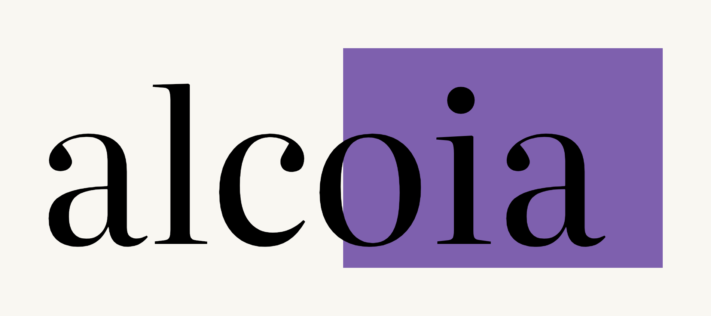

<p align="center">
  
</p>

<p align="center">
  <em>/ælˈkɔɪ.ə/ · al-KOY-uh</em>
</p>

<p align="center">
  It notices when you have stopped reading, and asks you about it.
</p>

---

alcoia is a browser extension that notices when you are struggling with a page and offers help
with that specific passage.

It does this by watching **how you read** — how fast you move through a paragraph compared with
how dense that paragraph is and how fast you normally read, whether you scroll back to re-read
something, whether you select or copy text, whether you leave the tab. None of that needs a
permission prompt, and none of it needs a camera.

When something looks off, it does not summarise at you. It **asks you a question** about the
passage you just read, with the sentence containing the answer quoted underneath. Answering is
the only thing in the system that produces ground truth: getting it right ends the interruption,
getting it wrong is when an explanation appears.

There is no webcam mode. Detection is telemetry only — no camera, no permission prompt, no video
of any kind, ever.

---

## The signal hierarchy

Two sources, in order of authority. This ordering is the product, not an implementation detail.

1. **Reader responses** — answers to retrieval questions. The only ground truth here. An answer
   outranks anything telemetry says. A correct answer resolves to `on_pace` and stops the system
   pressing; a dismissal asserts nothing at all, because declining to be tested says nothing
   about comprehension.
2. **Browser telemetry** — reading rate against text difficulty and your own baseline, scroll
   regressions, selection, copy, blur, idle. Precise, always available, no permission needed.
   **This is the only detection path.**

## Reading states

Six, and every one of them names an **observation**, not a feeling:

`on_pace` · `skimming` · `struggling` · `drifting` · `absent` · `unknown`

There is deliberately no `confused` and no `overloaded`. Those are internal states that cannot be
measured from a browser, and claiming to detect them would be claiming something the software
cannot support. `unknown` is a valid, correct and common answer — nothing ever interrupts on it.

## Interruption policy

Reader attention is the scarcest resource in this product, and a wrong interruption is worse than
a missed one.

- At most one interruption every 3 minutes
- At most five per session
- Never twice on the same paragraph
- Never on `unknown`
- Every interruption carries visible evidence — "You slowed down a lot here" — which turns an
  inference into an observation the reader can check

## The reading receipt

Press `Alt+I` and alcoia builds a record of what you covered and what you actually recalled. It
is built on your machine, you see the whole thing before it goes anywhere, and nothing is ever
submitted in the background.

It can be signed. **A valid signature means the receipt is unaltered since the server issued
it — nothing more.** It is not evidence that the reading happened: the figures come from your own
browser. That caveat is a field of the artifact itself, so it travels with the file.

The recall block is the substance. Coverage alone records that pages were scrolled through, which
is not evidence of reading and is trivial to fake — so when nothing was answered, the panel says
so in those words.

## Languages

Word and sentence counting goes through `Intl.Segmenter`, so the pace signals work in scripts
that do not put spaces between words — Chinese, Japanese, Thai, Khmer, Lao, Burmese — as well as
in space-delimited ones. Sentence splitting handles the Arabic question mark, the Urdu full stop
and the Devanagari danda, not only ASCII punctuation. Difficulty falls back to sentence and
clause structure where Flesch-Kincaid does not apply, with per-script anchors so ordinary prose
in Arabic or Chinese is not scored as unusually dense.

Reading-rate baselines are kept per language.

## Privacy

- **There is no camera path.** No webcam is ever started, by a message or otherwise — the code
  that could have started one is not in the extension.
- **No video, image or webcam frame is ever transmitted.** Verified by an automated browser test
  that inspects every outbound request body.
- **No analytics, no telemetry-to-vendor, no crash reporting, no third-party fonts or scripts.**
  Verified: zero third-party requests in the browser test.
- **There is no covert mode**, and there will not be one. Not behind a flag, not for an
  institution, not for testing.

Passage text **is** sent to a server to generate questions and explanations. That is the one
thing that leaves your machine, and it is stated here rather than buried.

Full data map, including everything stored locally and the disclosure obligations that follow
from it: [`LEGAL-DISCLOSURE-MAP.md`](LEGAL-DISCLOSURE-MAP.md).

## On accuracy

**No real-participant evaluation has been performed, and no accuracy figure for this project
should be treated as meaningful.**

There used to be a gaze classifier shipping in `alcoia/src/content/classifier.js`, trained on
synthetic data — rows generated from hand-written rules, then duplicated with Gaussian noise and
split randomly, so a row's noisy twin could sit in the test set while the original sat in
training. It has been deleted along with the rest of the webcam gaze path, so there is no longer
an accuracy figure of any kind in the shipped extension. A historical version of that training
pipeline still exists under `tldr classifier/` for provenance; it produces no code that ships.

Earlier drafts of this README carried an 88% figure and a "75–82% real-world" estimate for that
classifier. Both were removed before the classifier itself was.

## Install

```bash
git clone <this repo>
cd alcoia
npm install          # tooling only; the extension itself ships unbundled
```

Then load `alcoia/` as an unpacked extension at `chrome://extensions` with Developer mode on.

The backend (question generation, explanations, receipt signing) lives in a separate private
repository — it is not part of this repo. See [`alcoia/README.md`](alcoia/README.md) for the
extension's own setup, keyboard shortcuts and configuration reference.

## Verify

```bash
npm run lint                    # ESLint — a defect linter, not a style linter
npm test                        # 272 tests
npm run test:browser            # loads the extension in Chromium, English article
PAGE=zh npm run test:browser    # same checklist against a Chinese article
```

The browser check asserts the things that matter and that unit tests cannot see: that the content
script injects with no page errors, that **zero** `getUserMedia` calls ever happen, that no image
or video data appears in any request, that no third-party request is made, that the overlay
stylesheet actually reaches its elements, and that every keyboard shortcut still fires.

## Layout

```
alcoia/                  the extension (AGPL-3.0)
  src/content/           content scripts — detection, fusion, UI
    telemetry/           the detectors; each exports { update(), signal() }
  src/popup/             the toolbar panel and its pages
  src/shared/config.js   the one place the backend origin is defined
  src/styles/            fonts.css, overlay.css, panel.css
  src/libs/              pdf.js, jszip, fonts (SIL OFL 1.1)
tests/                   Vitest suites and the Chromium browser check
  contract/              vendored, dependency-free snapshots of the (separate-repo) server's
                         pure question/receipt logic, kept under test here only
CLAUDE.md                repository context — read before changing anything
WEBSITE-BRIEF.md         build brief for the marketing site
LEGAL-DISCLOSURE-MAP.md  code-derived data map for the privacy policy
NOTICE.md                licence scope and third-party components
```

## Licence

The extension client is **AGPL-3.0**, by choice — not because of a bundled dependency. It used to
also bundle WebGazer (GPLv3), which made the shipped package a combined copyleft work; WebGazer
has been removed along with the rest of the webcam gaze path (see `NOTICE.md`), and everything
still bundled under `src/libs/` is permissive or OFL.

Fonts (Literata, Plus Jakarta Sans) are **SIL OFL 1.1**, with their licences alongside the
binaries. The API server is a separate program in a separate private repository and was never
covered by this grant. Details in [`NOTICE.md`](NOTICE.md).
